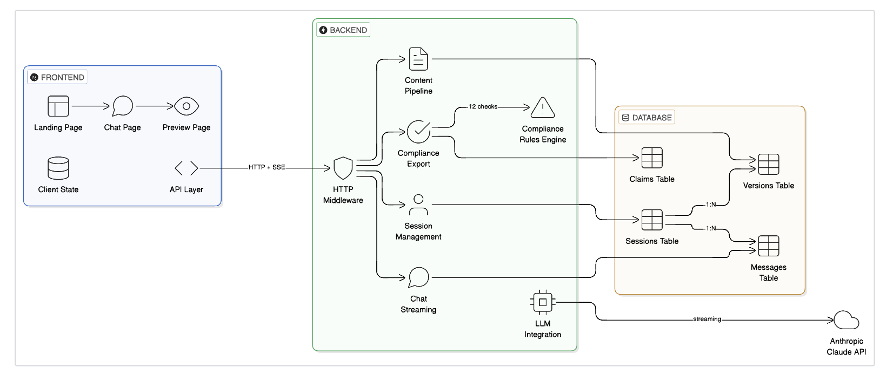

# Part 1: Product Design & System Architecture

## 1.1 User Flow Design

### High-Level User Journey Map


#### Step 1: Request Creation (`/`) Request Creation (`/`)
```
User lands on homepage
    │
    ├── Selects Content Format (email / banner / social)
    ├── Selects Target Audience (HCP / patients / caregivers / payers)
    ├── Selects Campaign Goal (awareness / education / CTA / launch)
    ├── Selects Tone (clinical / empathetic / urgent / informative)
    │
    └── Clicks "Start Briefing"
            │
            ├── POST /session → creates session with all parameters
            ├── Stores session_id in localStorage
            └── Navigates to /chat
```

#### Step 2: Conversational Alignment (`/chat`)
```
User enters chat interface
    │
    ├── Suggestion chips shown for quick start
    ├── User describes content needs in natural language
    │       │
    │       └── POST /chat/stream → SSE streaming response
    │               │
    │               ├── "Thinking (Xs)..." indicator with timer
    │               ├── "Thought for X seconds" label appears
    │               └── Assistant streams character-by-character
    │
    ├── Assistant asks clarifying questions (2-3 rounds)
    ├── Assistant suggests specific approved claims with citations
    ├── User can Clear Chat to restart briefing
    │
    └── User clicks "Continue to Preview →"
            │
            └── Navigates to /preview (session context carries over)
```

#### Step 3: Claim Selection, Generation & Compliance (`/preview`)
```
Claims Library loads (GET /claims/recommended)
    │
    ├── Claims displayed grouped by category:
    │       Indication → Efficacy → Mechanism → Dosing → QoL → Safety
    │       Each shows: source badge, citation, approval date
    │
    ├── User selects claims (checkboxes, Select All / Clear)
    │       DECISION POINT: User explicitly approves each claim
    │
    ├── "Generate Content" → POST /generate
    │       │
    │       ├── LLM generates HTML
    │       ├── Saved as new Version in DB
    │       ├── Rendered in sandboxed iframe
    │       └── Auto-triggers compliance review
    │
    ├── Compliance Review Panel (12-point check):
    │       ├── Green = pass
    │       ├── Yellow = warning (non-blocking)
    │       └── Red = fail (blocks export)
    │
    ├── Iterative Editing Loop:
    │       ├── User types natural language instruction
    │       │       e.g., "Move safety above efficacy"
    │       ├── POST /edit → LLM applies edit
    │       ├── New Version saved, compliance auto-rechecks
    │       └── Repeat until satisfied
    │
    ├── Version History:
    │       ├── All revisions listed with timestamps
    │       └── "Load" to restore any previous version
    │
    └── DECISION POINT: Export gate
            ├── If any red flags → export blocked
            └── If all pass/warn → "Export Package" enabled
```

#### Step 4: Export & Distribution
```
User clicks "Export Package"
    │
    ├── POST /export
    │       ├── Runs final compliance review
    │       ├── Blocks if any failures remain
    │       └── Returns ZIP package
    │
    └── Downloads 1 file:
            └── fruzaqla-export-revN.zip
                    ├── html/index.html          (full HTML content)
                    ├── metadata/claims.json      (sources, citations, approval dates)
                    ├── metadata/assets.json     (asset manifest)
                    ├── compliance/report.json   (overall status, reviewed_at, all checks)
                    └── manifests/asset_manifest.csv
```

---

## 1.2 System Architecture

### Architecture Diagram



---

## 1.3 Data Model Design

### Entity-Relationship Diagram


